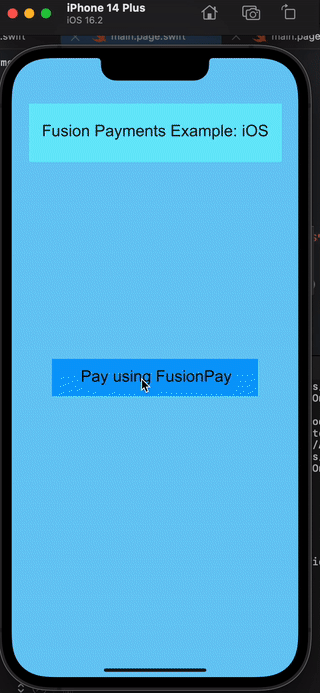

# FusionPayments
## Cross-Platform Swift library to integrate Apple-Pay & Google-Pay





### Add the FusionPayments library: 

#### `Package.swift`


```swift
 dependencies: [
    .package(
      name: "FusionPayments", url: "https://github.com/scade-platform/FusionPayments.git",
      .branch("main")),
   
  ],
    targets: [
        .target(
            name: "ScadePaymentsApp",
            dependencies: [
            	.product(name: "FusionPayments", package: "FusionPayments"),
            ],
            exclude: ["main.page"],
            swiftSettings: [
                .unsafeFlags(["-F", SCADE_SDK], .when(platforms: [.macOS, .iOS])),
                .unsafeFlags(["-I", "\(SCADE_SDK)/include"], .when(platforms: [.android])),
            ]
        )
    ]
)
```


### Declare FusionPayments Manager:

#### `main.page.swift`


```swift
var paymentManager: FusionPaymentsManager?
```


 
### Create a Payment request: 


```swift
let pNetworks: [PaymentNetwork] = [PaymentNetwork.amex, .visa, .masterCard]

      let paymentSummaryItem: PaymentSummaryItem = PaymentSummaryItem(
        label: "SomeLabelForShopping", amount: 3.3)

      let countries: Set<String> = ["US", "UK"]

      let paymentRequest: PaymentRequest = PaymentRequest(
        merchantIdentifier: "merchant.com.vedant.fusionpayments", countryCode: "US",
        currencyCode: "USD", supportedNetworks: pNetworks,
        paymentSummaryItem: paymentSummaryItem, supportedCountries: countries)
```


### Initialize `FusionPaymentsManager` with `PaymentRequest`: 


```swift
 self?.paymentManager = FusionPaymentsManager(paymentRequest: paymentRequest)
```


### Finally, handle the response of payment status: 


```swift
self?.paymentManager?.initiatePayment(
        paymentRequest: paymentRequest,
        paymentStatus: { (status: PaymentStatus, error: PaymentError?) in
          print(status)
          print(error)

        },
        paymentSheetViewState: {
          viewState in
          print("viewed state")
          print(viewState)
        })
```

